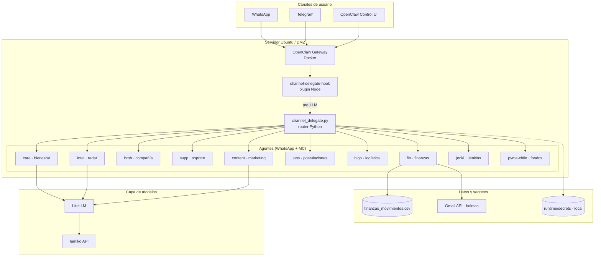
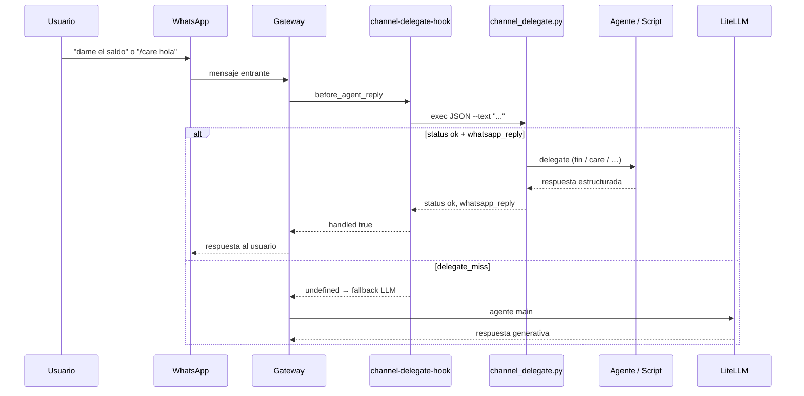
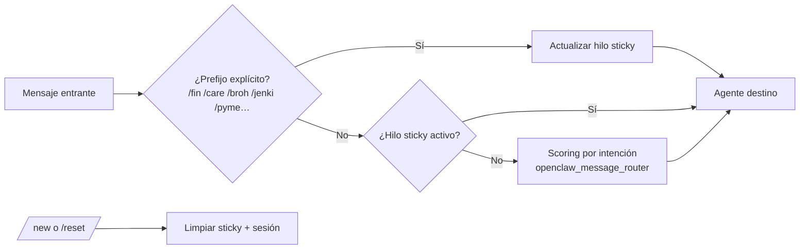
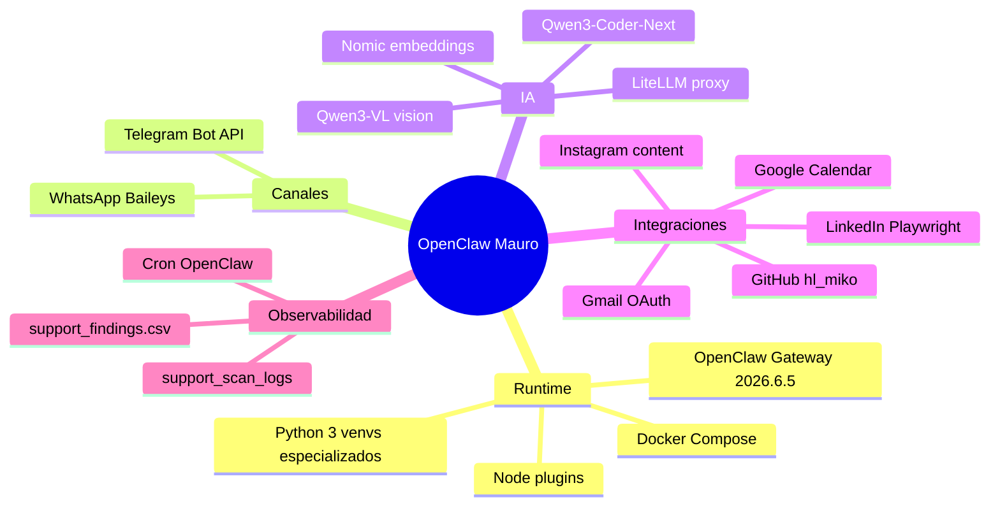

# OpenClaw Personal AI Platform

> Empieza por [`REPO_MAP.md`](REPO_MAP.md): estructura, propietarios, runtime y
> rutas de compatibilidad para humanos y agentes.

**Plataforma multi-agente en producción** — WhatsApp y Telegram como interfaz, orquestación determinística, LLM vía LiteLLM y despliegue Docker en DMZ.

> Proyecto personal de **Mauro Castro** · DevOps · Arquitectura cloud · Automatización con IA  
> Repositorio: [github.com/Maurog-castros/openclaw-ubuntu-server](https://github.com/Maurog-castros/openclaw-ubuntu-server)

---

## Resumen ejecutivo

Sistema que convierte mensajería instantánea en un **centro de operaciones con agentes especializados**: finanzas, bienestar, compañía narrativa (Broh), soporte OpenClaw, inteligencia de mercado, contenido, empleabilidad, logística HL-Go, Jenkins (`/jenki`), fondos pyme y pipeline comercial — **13 agentes** registrados en el gateway (ver catálogo abajo).

El diseño prioriza **rutas determinísticas** (scripts Python + reglas) sobre alucinaciones del LLM en flujos críticos: saldos bancarios, boletas, pull de código y respuestas a WhatsApp. El modelo interviene donde aporta valor: conversación empática, síntesis de tendencias y redacción de contenido.

| Métrica | Valor |
|---------|-------|
| Scripts Python operativos | ~100 |
| Agentes en gateway | 13 |
| Canales | WhatsApp, Telegram, Control UI |
| Gateway | OpenClaw 2026.6.5 (Docker) |
| LLM | Qwen3-Coder-Next vía LiteLLM → Iamiko |
| Visión (boletas / OCR) | Qwen3-VL-30B |

---

## Arquitectura de alto nivel



---

## Flujo de un mensaje WhatsApp



**Decisión de diseño:** el hook intercepta **antes** del LLM para que operaciones financieras y de routing no dependan de que el modelo ejecute tools correctamente.

---

## Enrutado multi-agente



| Regla | Comportamiento |
|-------|----------------|
| Prefijo `/care`, `/broh`, `/fin`, etc. | Abre o cambia el hilo a ese agente |
| Mensajes sin prefijo | Continúan en el **mismo agente** del hilo |
| `/new` o `/reset` | Corta el hilo y reinicia sesión |
| Sin prefijo ni sticky | Detección por intención (ej. «dame el saldo» → fin) |

---

## Catálogo de agentes

Catálogo compartido machine-readable: [`data/workspace/_catalog/agents/README.md`](data/workspace/_catalog/agents/README.md).

| Agente | Prefijo | Dominio | Implementación destacada |
|--------|---------|---------|--------------------------|
| **main** | — | Orquestador canal | `channel_delegate.py`, plugin hook |
| **fin** | `/fin` | Finanzas CLP | Saldo Santander, boletas OCR, transferencias, dedupe Gmail+screenshot |
| **care** | `/care` | Bienestar personal | Conversación LLM acotada (≤250 chars), diario solo explícito |
| **broh** | `/broh` | Compañía narrativa | Memoria de historias, perspectiva empática; pulso proactivo vía cron |
| **supp** | `/supp` | SRE / OpenClaw | Scan de logs, cron, remediación gateway |
| **intel** | `/intel` | Business intel | Radar diario HN/Reddit/GitHub/LinkedIn, YouTube |
| **content** | `/content` | Marketing | Instagram, borradores LinkedIn |
| **jobs** | `/jobs`, `/postula` | Empleabilidad | Match CV, búsqueda LinkedIn, Easy Apply |
| **hlgo** | `/hlgo`, `/hl` | Producto HL-Go | Git pull determinístico, Playwright QA, rama `dev.h-l.cl` |
| **jenki** | `/jenki` | Jenkins / CI | API Jenkins vía `jk`; builds, logs, cola (ver [MODEL-LAYER](docs/MODEL-LAYER-AND-MISSION-CONTROL.md)) |
| **pyme-chile** | `/pyme` | Fondos concursables | Sercotec, Corfo, capital semilla; workspace dedicado |
| **sales** | — | Pipeline comercial | Leads desde intel; sesión LLM / Mission Control |
| **hl-miko-web** | — | Dev web hl_miko | Backend PHP HL-Go, APIs; mismo repo que hlgo, enfoque web |

Agentes sin prefijo WhatsApp (`sales`, `hl-miko-web`) no pasan por `channel_delegate`; se usan desde Mission Control o sesiones LLM directas. El resto admite prefijo explícito, hilo sticky o detección por intención.

---

## Catastro de cambios recientes

Evolución del sistema en el ciclo de desarrollo actual (junio 2026).

### Infraestructura y gateway

| Cambio | Impacto |
|--------|---------|
| Actualización **OpenClaw 2026.6.1 → 2026.6.5** | Gateway estable, UI de control actualizada |
| Imagen **`openclaw-with-ssh`** | SSH, git, gh y wrappers host dentro del contenedor |
| Publicación en **GitHub** con `.gitignore` estricto | Sin secretos ni imágenes; push protection compatible |
| Stack Docker: gateway + LiteLLM + Redis + Postgres | Inferencia local/remota unificada |

### Canal WhatsApp / Telegram

| Cambio | Impacto |
|--------|---------|
| Plugin **`channel-delegate-hook`** | Respuestas determinísticas llegan a WhatsApp (no solo a la UI) |
| Fix `status: ok` + `--json` en delegate care | Corrige respuestas que quedaban solo en Control UI |
| **Hilo sticky** por agente | Conversación continua hasta `/new`, `/reset` u otro prefijo |
| Menú numerado 1–5 y formato nativo WhatsApp | UX consistente en finanzas |

### Agente care (`/care`)

| Cambio | Impacto |
|--------|---------|
| Conversación vía subagente `care` | Tono de psicólogo de confianza, sin citas automáticas |
| Diario **solo explícito** (`anótalo en el diario`) | Elimina falsos positivos con mensajes que empiezan por «hoy» |
| `truncate_whatsapp(250)` | Mensajes legibles en móvil |
| Separación check-in / diario / conversación emocional | Routing claro en `vida_delegate.py` |

### Agente broh (`/broh`)

| Cambio | Impacto |
|--------|---------|
| `broh_delegate.py` + agente LLM `broh` | Compañía y perspectiva; no reemplaza `/care` clínico |
| Memoria narrativa en `data/workspace/broh/data/` | Historias, observaciones y estado de pulso |
| `broh_pulse.py` + cron | Mensajes proactivos de baja frecuencia (10–21 h) |

### Agente jenki (`/jenki`)

| Cambio | Impacto |
|--------|---------|
| Agente `jenki` en gateway | Operaciones Jenkins vía wrapper `jk` y API token |
| Prefijo `/jenki` en WhatsApp | Builds, logs y cola CI desde el canal |
| Detalle operativo | [`docs/MODEL-LAYER-AND-MISSION-CONTROL.md`](docs/MODEL-LAYER-AND-MISSION-CONTROL.md) § Jenkins |

### Agente fin (`/fin`)

| Cambio | Impacto |
|--------|---------|
| Pipeline boletas + visión (Qwen3-VL) | Foto de ticket → movimiento en CSV |
| Saldo Santander con ancla y screenshot | Sin inventar montos desde el LLM |
| Dedupe multi-fuente | Vincula misma transacción Gmail + captura |
| Reportes: mensual, comercio, transferencias, cuadratura cartola | Consultas en lenguaje natural |

### HL-Go y DevOps de producto

| Cambio | Impacto |
|--------|---------|
| Checkout determinístico rama **`dev.h-l.cl`** | Evita ramas fantasma (`principal`, `main` incorrecto) |
| `hl_go_delegate.py` + credenciales fuera del repo | Pull seguro vía `secrets/` |
| Playwright validate | QA UI automatizado post-pull |

### Calidad y pruebas

| Cambio | Impacto |
|--------|---------|
| `test_openclaw_router_e2e.py` | 18+ casos de routing + sticky thread |
| Scripts `apply_openclaw_*_config.py` | Config declarativa reproducible por agente |
| Catálogo compartido `_catalog/agents/` | Documentación machine-readable entre agentes |

---

## Stack tecnológico



| Capa | Tecnologías |
|------|-------------|
| **Orquestación** | OpenClaw, plugins SDK, hooks `before_agent_reply` |
| **Routing** | Python 3, regex + scoring, estado JSON sticky |
| **LLM** | LiteLLM, OpenAI-compatible API, Iamiko |
| **Datos** | CSV finanzas, JSON workspaces, SQLite sesiones (runtime) |
| **Automatización** | cron, Gmail watch, pipelines shell |
| **QA** | Playwright, tests e2e routing, stress tests LLM |
| **Seguridad** | Secretos fuera de git, DMZ, allowlist WhatsApp |

---

## Patrones de ingeniería (para discusión en entrevista)

1. **Router híbrido** — Reglas duras para dinero y git; LLM para lenguaje natural y síntesis.
2. **Hook pre-LLM** — Un plugin de 100 líneas evita que el orquestador ignore scripts críticos.
3. **Sticky session por agente** — UX conversacional sin reescribir el prefijo en cada mensaje.
4. **Delegates como micro-servicios en scripts** — Cada dominio expone `--json` y `whatsapp_reply`.
5. **Config como código** — `apply_openclaw_*.py` versionados; runtime (`openclaw.json`) en `.gitignore`.
6. **Defensa en profundidad de secretos** — `.gitignore`, plantillas `.example`, push protection GitHub.

---

## Estructura del repositorio

```
openclaw-mauro/
├── scripts/              # ~100 scripts: delegates, pipelines, apply_* config
├── data/
│   ├── config/extensions/channel-delegate-hook/   # Plugin gateway
│   └── workspace/        # SOUL, AGENTS, memoria por agente
├── config/               # Plantillas y skills por dominio
├── docker-overrides/     # Imagen openclaw-with-ssh + compose mounts
├── openclaw/             # Submódulo upstream OpenClaw
├── runtime/              # CV, secretos, logs (canónico; ver REPO_MAP.md)
├── secrets/              # Symlink → runtime/secrets (ver docs/SECRETS.md)
└── docs/SETUP.md         # Guía operativa detallada
```

---

## Demos sugeridas en entrevista

1. **WhatsApp → saldo** — Mensaje sin prefijo; respuesta con monto real desde CSV/ancla.
2. **Hilo care** — `/care` + conversación de motivación sin diario automático.
3. **Cambio de agente** — Desde care a `/fin saldo` en el mismo chat.
4. **HL-Go pull** — `/hlgo pull` con checkout a `dev.h-l.cl` sin git manual del LLM.
5. **Arquitectura** — Diagrama de hook + delegate (este README).

---

## Operación local

Ver **[docs/SETUP.md](docs/SETUP.md)** para clonar, secretos, Docker y actualizaciones.

```bash
git clone --recurse-submodules https://github.com/Maurog-castros/openclaw-ubuntu-server.git
cd openclaw-ubuntu-server
cp config/stack.env.example openclaw/.env   # editar tokens
docker build -t openclaw-with-ssh:local docker-overrides/openclaw-with-ssh
cd openclaw && docker compose up -d
```

---

## Capa de modelos y Mission Control

La capa de inferencia (chat via `ia.iamiko.cl`, embeddings locales con Ollama) y el dashboard **Mission Control** estan documentados en detalle en **[docs/MODEL-LAYER-AND-MISSION-CONTROL.md](docs/MODEL-LAYER-AND-MISSION-CONTROL.md)**.

- **Fuente unica de verdad**: `data/config/` (con symlink `~/.openclaw` apuntando ahi). Sin configs paralelas ni agentes duplicados.
- **Chat**: agentes -> LiteLLM local -> `https://ia.iamiko.cl/v1` (modelo `auto`; key en `IAMIKO_API_KEY` del `.env`).
- **Fallback de chat**: si ia.iamiko.cl cae, LiteLLM reintenta en **OpenRouter** (`openrouter/auto`, key `OPENROUTER_API_KEY`).
- **Embeddings**: container `openclaw-embeddings` (Ollama `nomic-embed-text`, 768 dims) + watchdog `autoheal`.
- **Mission Control**: dashboard en `http://192.168.1.12:3030` (montaje read-only sobre la config; 13 agentes sincronizados).

---

## Autor

**Mauro Castro** — DevOps · Cloud · IA aplicada  
Infraestructura en DMZ (`maurocastro.cl`) · Automatización personal y profesional con agentes

*README orientado a portfolio técnico — Junio 2026*
