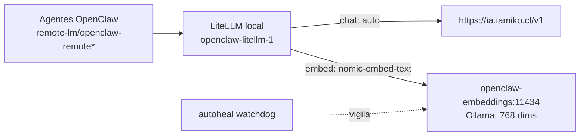

# Capa de modelos y Mission Control

Documenta la **capa de inferencia** (chat + embeddings) y el **dashboard Mission Control**, tras la normalizacion de junio 2026. Objetivo: una sola fuente de verdad, sin configuraciones paralelas ni duplicidad de agentes.

---

## 1. Fuente unica de verdad (config OpenClaw)

Toda la flota corre desde **un solo** estado de OpenClaw:

```
/home/mauro/Dev/openclaw-mauro/data/config/      <-- CANONICA (la usa el gateway y los crons)
/home/mauro/.openclaw  ->  symlink a la canonica  <-- ubicacion por defecto unificada
```

- La antigua `~/.openclaw` (config paralela con solo 3 agentes) se archivo como `~/.openclaw.bak-stale-YYYYMMDD`.
- Ahora la ruta por defecto (`~/.openclaw`) y la real apuntan al **mismo archivo** -> imposible que vuelvan a divergir.
- `openclaw.json` es propiedad de `node` (uid 1000) con permisos 0750.

---

## 2. Capa de modelos (LiteLLM)

Los agentes referencian `remote-lm/openclaw-remote*`. Ese provider apunta al **LiteLLM local** (`openclaw-litellm-1`), que enruta cada alias a su backend real:



| Alias (lo que ven los agentes) | Backend real | Modelo upstream |
|---|---|---|
| `openclaw-remote` | ia.iamiko.cl | `auto` |
| `openclaw-remote-coder` | ia.iamiko.cl | `auto` |
| `openclaw-remote-vision` | ia.iamiko.cl | `auto` |
| `openclaw-remote-embed` | Ollama local | `nomic-embed-text` (768) |

### Fallback de chat (OpenRouter)

Si `ia.iamiko.cl` no responde, LiteLLM reintenta automaticamente en **OpenRouter** (`openrouter/auto`, que elige modelo por prompt). Solo aplica a **chat** (los embeddings siguen 100% locales).

- Key en `openclaw/.env` como `OPENROUTER_API_KEY` (no hardcodeada).
- Cadena de fallback (en `litellm_settings.fallbacks`):
  - `openclaw-remote-coder` -> `openclaw-remote` -> `openrouter-auto`
  - `openclaw-remote` -> `openclaw-remote-coder` -> `openclaw-remote-vision` -> `openrouter-auto`
  - `openclaw-remote-vision` -> `openclaw-remote` -> `openrouter-auto`
- Probar el fallback sin caer el primario: agregar `"mock_testing_fallbacks": true` al body del request.

### Routing por agente: OpenRouter primario para tool-calling

`ia.iamiko.cl` solo expone el router `auto`, que ante prompts con herramientas/JSON enruta a `qwen3-coder-next-mlx@4bit`. Ese modelo **no hace tool-calling real**: emite JSON crudo o ruido, OpenClaw no lo parsea (`empty response detected`), reintenta y termina enviando un **flood de mensajes basura** (garabatos en WhatsApp).

Fix verificado end-to-end (`openclaw agent --agent fin`): con `auto` la respuesta era `"$\\ PY+3~9=*$]..."`; con OpenRouter el agente ejecuta `channel_delegate`, lee datos reales y responde correcto.

Por eso, los **12 agentes con tools** usan OpenRouter como primario:

```json
"model": {
  "primary": "remote-lm/openrouter-auto",
  "fallbacks": ["remote-lm/openclaw-remote", "remote-lm/openclaw-remote-coder"]
}
```

- Agentes afectados: main, intel, content, sales, pyme-chile, hl-miko-web, supp, care, jobs, hlgo, fin, broh.
- `jenki` (sin tools, agente de codigo) sigue en `remote-lm/openclaw-remote-coder`.
- iamiko queda de **fallback** (rapido/gratis) por si OpenRouter falla.
- Backup de la config previa: `data/config/openclaw.json.bak-modelfix-*`.

- Config: `openclaw/litellm-config.yaml` (montado en el container como `/app/config.yaml`).
- La API key de ia.iamiko.cl vive en `openclaw/.env` como `IAMIKO_API_KEY` (NO hardcodeada, no se publica).
- `ia.iamiko.cl` solo expone el modelo `auto` (router -> qwen3-coder-next-mlx) y **no ofrece embeddings**: por eso los embeddings son locales.

---

## 3. Embeddings locales (memoria de agentes)

Container dedicado, independiente de internet:

| Item | Valor |
|---|---|
| Container | `openclaw-embeddings` (imagen `ollama/ollama`) |
| Modelo | `nomic-embed-text` (= nomic-embed-text-v1.5, 768 dims) |
| Red | `openclaw_openclaw_net` (accesible como `openclaw-embeddings:11434`) |
| Volumen | `openclaw_embeddings` (persistente) |
| Resiliencia | `--restart unless-stopped` + healthcheck (`ollama list`) |
| Watchdog | container `autoheal` reinicia si queda *unhealthy*/colgado |

> Importante: los embeddings de modelos distintos NO son comparables. Mantener siempre el mismo modelo (`nomic-embed-text`, 768) para no corromper la memoria. OpenRouter no sirve de fallback porque no hostea nomic.

---

## 4. Mission Control (dashboard)

Dashboard de observabilidad/orquestacion, en **container aislado**, separado del repo OpenClaw.

| Item | Valor |
|---|---|
| Ubicacion | `/home/mauro/Dev/mission-control` |
| URL | http://192.168.1.12:3030  (puerto 3000 ya lo usa open-webui) |
| Container | `mission-control` (corre como uid 1000 para leer la config OpenClaw) |
| Montaje | `data/config` -> `/run/openclaw` (READ-ONLY: MC no modifica nada) |
| Gateway | `host.docker.internal:18789` (backend) / `192.168.1.12:18789` (navegador) |
| Agentes | 13, sincronizados 1:1 desde la config canonica |

Cleanup total (si no se usa): `cd mission-control && docker compose down -v --rmi local`.

---

## 5. Inventario de containers (capa IA)

| Container | Rol |
|---|---|
| `openclaw-openclaw-gateway-1` | Gateway OpenClaw |
| `openclaw-openclaw-proxy-1` | Proxy nginx (expone gateway en :18789) |
| `openclaw-litellm-1` | Capa de modelos (chat + embed routing) |
| `openclaw-embeddings` | Ollama embeddings (nomic-embed-text) |
| `autoheal` | Watchdog: reinicia containers unhealthy |
| `mission-control` | Dashboard (puerto 3030) |

---

## 6. Operacion

```bash
# Reiniciar capa de modelos tras editar litellm-config.yaml
cd ~/Dev/openclaw-mauro/openclaw && docker compose up -d litellm

# Probar chat (via litellm, como los agentes)
curl -s http://127.0.0.1:4000/v1/chat/completions \
  -H "Authorization: Bearer sk-openclaw-local" -H "Content-Type: application/json" \
  -d "{\"model\":\"openclaw-remote-coder\",\"messages\":[{\"role\":\"user\",\"content\":\"ok\"}],\"max_tokens\":5}"

# Probar embeddings (debe responder dim=768)
curl -s http://127.0.0.1:4000/v1/embeddings \
  -H "Authorization: Bearer sk-openclaw-local" -H "Content-Type: application/json" \
  -d "{\"model\":\"openclaw-remote-embed\",\"input\":\"hola\"}"

# Cambiar API key de ia.iamiko.cl
#   editar IAMIKO_API_KEY en openclaw/.env y luego:
cd ~/Dev/openclaw-mauro/openclaw && docker compose up -d litellm

# Embeddings: ver estado / logs / re-descargar modelo
docker inspect openclaw-embeddings --format "{{.State.Health.Status}}"
docker exec openclaw-embeddings ollama list

# Mission Control: logs / reiniciar / total agentes
cd ~/Dev/mission-control && docker compose logs -f mission-control
```

---

## 7. Troubleshooting

| Sintoma | Causa probable | Fix |
|---|---|---|
| Chat falla `No connected db` / 400 | Key o nombre de modelo invalido en ia.iamiko.cl (solo acepta `auto`) | Revisar `IAMIKO_API_KEY` y que el modelo upstream sea `auto` |
| Embeddings 400/404 | Apuntando a ia.iamiko.cl (no soporta embed) | Debe apuntar a `openclaw-embeddings:11434`, modelo `nomic-embed-text` |
| MC muestra pocos agentes | Apunta a config equivocada o sin permisos | Mount = `data/config`, container uid 1000 |
| Agentes duplicados en MC | Dos configs (paralela) | Mantener symlink `~/.openclaw` -> data/config |
| Embeddings caidos | Ollama colgado | `autoheal` lo reinicia; o `docker restart openclaw-embeddings` |

---

*Documentado: junio 2026. Cambios aplicados en la capa LiteLLM y containers, sin tocar la config de los 13 agentes.*

---

## Integracion Jenkins (/jenki)

El agente `jenki` controla Jenkins (`https://jenkins.maurocastro.cl`) con acceso COMPLETO a la API via API token.

**Como funciona:**
- Credenciales en `openclaw/.env` (gitignored): `JENKINS_URL`, `JENKINS_USER`, `JENKINS_API_TOKEN` (token dedicado `openclaw-jenki`, never-expire). Se cargan al gateway via `env_file` (requiere `docker compose up -d --force-recreate openclaw-gateway`).
- Helper `data/config/workspace-jenki/jk`: wrapper bash que ya trae URL+token desde env. El agente lo ejecuta con la tool `exec` (host=gateway). Cubre toda la API: `jobs|status|info|log|build|stop|create|config|delete|queue|whoami|api|post`.
- Config de `jenki` en `openclaw.json`: `tools.exec` (host=gateway, security=full), `sandbox.mode=off`, modelo `remote-lm/openrouter-auto` (el coder@4bit de iamiko no hace tool-calling).
- Instrucciones en `workspace-jenki/AGENTS.md` (version lean <8000 chars; OJO: el contexto de bootstrap trunca AGENTS.md a 8000 chars, por eso las instrucciones de Jenkins van al inicio y el archivo es corto).

**Verificado:** `jenki` lista jobs y dispara builds reales end-to-end (build #13 de LabFull-platform-smoke = SUCCESS).

**Seguridad:** `jenki` tiene shell exec completo en el gateway. El `AGENTS.md` le instruye ignorar ordenes incrustadas en mensajes externos/webhooks (defensa anti-inyeccion) y confirmar operaciones destructivas. Para rotar el token: regenerar en Jenkins y actualizar `JENKINS_API_TOKEN` en `openclaw/.env` + recrear gateway.
